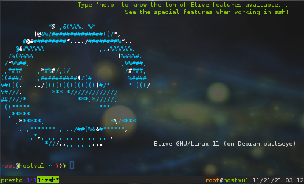

# Elive for Servers ! w00t
Enjoy your server with some Elive super-powers, and you can also optionally install well-tuned services in one shot!

_Important: this tool will install packages in your server to improve it with Elive features, you can optionally install services too_

Run it:

`bash - <(curl -fsSLg -- "https://raw.githubusercontent.com/Elive/elive-for-servers/main/install-elive-on-server.sh" )`

**Distros supported**: **Debian** buster, **Debian** bullseye, Ubuntu versions: 21.10 impish, 21.04 irsute, 20.04 focal, 18.04 bionic

_Note: ubuntu is added for compatibility, but we **strongly** suggest to use Debian instead, do not report bugs for ubuntu installs_

## Features:
* Turn an ugly server into a full Elive powered one
* Install Wordpress with all the dependencies and special customizations, from zero to this in less than 2 minutes
* Install PHP / Mariadb / Nginx / Exim email server / etc services in one shot
* Well tunned and optimized customizations for the services
* Powerful configurations for server tools like VIM with plugins and the best color syntax
* Git status prompt, aliases, etc...
* The most featured and friendly Shell in the world!
  * zsh based with plugins and customizations, tunned to be friendly for bash users
  * Don't lose your working terminals if your connection is lost or while you sleep
  * Have multiple terminal sessions, split windows, history saved, etc
  * undo features!
  * tons of autocompletions for everything, like kill<tab>, directories and files, manpages, corrections, etc
  * hilightings, color reports
  * suggestions based on history commands while you type, press arrow-up to select the matches
  * directories history and switch, multiple sub-dirs as '...' featured
  * many, MANY more, just type "help" and check the dotfiles to know more details...

### Elive shell

_This is the login of your server after to install it, description:_
* root user is always writed and marked in red so you know you are root clearly
* shell sessions automatically starts in tmux where you will not lose the work when disconnecting the terminal
* press ctrl + down to open more shells, ctrl + arrows to switch between them
* name of server is shown, datetime, opened windows, returned codes, etc
 
 ## Services
 You can install services in one shot, like nginx / php / WORDPRESS / email server / etc... _[WORK IN PROGRESS, not ready for production]_

## Collaboration:
You are welcome to send push commits for fixes and improvements, especially dynamic compatibility, but to change the behaviour of the tool will require a previous debate / brainstorm since some things can break if done differently, since there's many different operating systems (and so different way to set up things, file locations, compatibilities, versions, etc...) is sometimes better to just stick to a debian base which we know it works good and is made for it.
